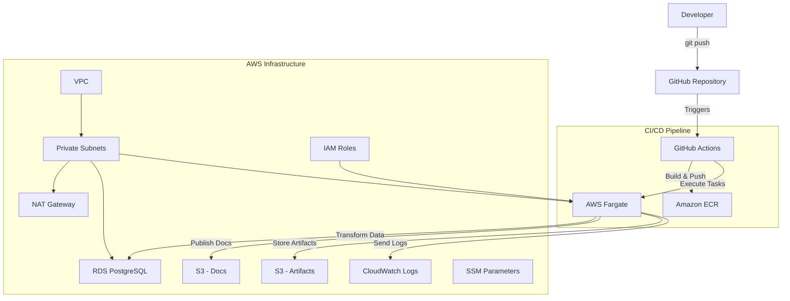

# Northwind Analytics Pipeline

Automated data pipeline built with dbt, AWS, and Terraform for processing and analyzing Northwind database. Features infrastructure-as-code, CI/CD with GitHub Actions, and serverless execution on AWS Fargate.

## Table of Contents

- [Features](#features)
- [Quick Start](#quick-start)
- [Architecture](#architecture)
- [Project Structure](#project-structure)
- [Installation](#installation)
- [Usage](#usage)
- [Accessing Results](#accessing-results)
- [Cleanup](#cleanup)

## Features

- **Fully Automated Pipeline**: Push code changes and watch your data transformations deploy automatically
- **Infrastructure as Code**: Complete AWS infrastructure managed with Terraform
- **Serverless Execution**: Run dbt transformations on AWS Fargate without managing servers
- **Secure Credentials**: Database passwords stored securely in AWS SSM Parameter Store
- **Automated Documentation**: dbt docs automatically generated and hosted on S3
- **Comprehensive Testing**: Built-in data quality tests with dbt test framework
- **Cost Effective**: Pay only for compute resources when pipeline runs

## Quick Start

See the pipeline in action:

```bash
# Clone the repository
git clone https://github.com/BrunoChiconato/dbt-analytics-pipeline.git
cd dbt-analytics-pipeline

# Deploy infrastructure (one-time setup)
cd terraform
terraform init && terraform apply

# Make a change to trigger the pipeline
echo "-- Testing pipeline" >> northwind/models/staging/stg_customers.sql
git add . && git commit -m "Trigger pipeline" && git push
```

Watch the magic happen in your GitHub Actions tab! The pipeline will:
1. Build a Docker image with your dbt project
2. Run data transformations in AWS Fargate
3. Execute data quality tests
4. Deploy documentation to S3

## Architecture

The pipeline leverages modern DataOps practices with a fully automated, scalable architecture:



### How It Works

1. **Developer pushes code** to the `main` branch
2. **GitHub Actions workflow** automatically triggers
3. **Docker image** is built and pushed to Amazon ECR
4. **ECS Fargate task** executes dbt transformations
5. **Data quality tests** validate the results
6. **Documentation** is generated and deployed to S3
7. **Artifacts** are stored for debugging and auditing

## Project Structure

```
.
├── .github/
│   └── workflows/
│       ├── dbt_run_workflow.yml       # Main CI/CD pipeline
│       └── dbt_docs_deploy.yml        # Documentation deployment
├── docker/
│   └── Dockerfile                     # dbt runtime environment
├── northwind/
│   ├── dbt_project.yml                # dbt configuration
│   ├── profiles.yml                   # Database connections
│   └── models/
│       ├── staging/                   # Raw data cleaning layer
│       ├── intermediate/              # Business logic layer
│       └── marts/                     # Analytics-ready data
├── terraform/
│   ├── main.tf                        # Terraform configuration
│   ├── networking.tf                  # VPC and network setup
│   ├── rds.tf                         # PostgreSQL database
│   ├── fargate.tf                     # ECS cluster and tasks
│   ├── s3.tf                          # Storage buckets
│   └── iam.tf                         # Security policies
├── northwind.sql                      # Sample data
└── README.md                          # This file
```

## Installation

### Prerequisites

- AWS Account with administrator permissions
- AWS CLI installed and configured
- Terraform CLI (v1.5+)
- PostgreSQL client
- Git

### Step 1: Deploy Infrastructure

1. Create S3 bucket for Terraform state:
   ```bash
   aws s3 mb s3://your-unique-tfstate-bucket --region us-east-1
   ```

2. Update bucket name in `terraform/main.tf`

3. Create `terraform/terraform.tfvars`:
   ```hcl
   db_password = "your-secure-password-here"
   ```

4. Deploy infrastructure:
   ```bash
   cd terraform
   terraform init
   terraform plan
   terraform apply
   ```

### Step 2: Configure GitHub Secrets

Add these secrets to your GitHub repository (Settings > Secrets and variables > Actions):

| Secret Name | Description |
|------------|-------------|
| `AWS_ACCESS_KEY_ID` | Your AWS access key |
| `AWS_SECRET_ACCESS_KEY` | Your AWS secret key |
| `DBT_ARTIFACTS_BUCKET` | From Terraform output |
| `DBT_DOCS_BUCKET` | From Terraform output |
| `FARGATE_SECURITY_GROUP` | Security group ID (sg-xxx) |
| `PRIVATE_SUBNET_1` | First private subnet ID |
| `PRIVATE_SUBNET_2` | Second private subnet ID |

### Step 3: Load Sample Data

```bash
psql -h [RDS_ENDPOINT] -U dbt_user -d northwind -f northwind.sql
```

## Usage

### Trigger the Pipeline

Any change to files in the `northwind/` directory will trigger the pipeline:

```bash
# Make a change
echo "-- Updated model" >> northwind/models/staging/stg_orders.sql

# Push to trigger pipeline
git add .
git commit -m "Update orders model"
git push origin main
```

### Monitor Execution

1. Go to the **Actions** tab in your GitHub repository
2. Click on the running workflow to see real-time logs
3. Check CloudWatch Logs for detailed dbt output

### Query Transformed Data

Connect to your RDS instance and query the gold schema:

```sql
-- Example: Top customers by revenue
SELECT * FROM gold.customer_metrics
ORDER BY total_revenue DESC
LIMIT 10;
```

## Accessing Results

- **Documentation**: Visit `http://[DBT_DOCS_ENDPOINT]` (from Terraform output)
- **Transformed Data**: Query the `gold` schema in RDS PostgreSQL
- **Logs**: Check CloudWatch Logs group `/ecs/northwind/dbt`
- **Artifacts**: Browse the artifacts S3 bucket for manifest.json and run results

## Cleanup

To avoid ongoing AWS charges:

1. Delete ECR images:
   ```bash
   aws ecr delete-repository --repository-name northwind-dbt --force
   ```

2. Empty S3 buckets:
   ```bash
   aws s3 rm s3://[ARTIFACTS_BUCKET] --recursive
   aws s3 rm s3://[DOCS_BUCKET] --recursive
   ```

3. Destroy infrastructure:
   ```bash
   cd terraform
   terraform destroy
   ```

4. Delete Terraform state bucket:
   ```bash
   aws s3 rb s3://your-tfstate-bucket --force
   ```